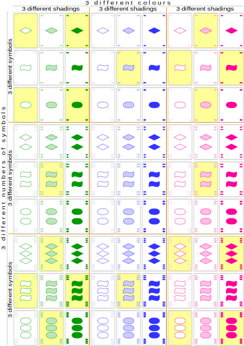
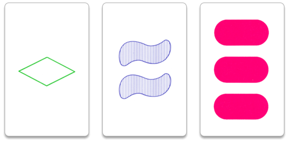

# CS-162 Portfolio Project Proposal: Set Card Game Project
For this project, students will write a class called `SetGame` that allows two people to play a console-based version of the card game Set.

## Description
* Set is a card game that is usually played with 1 or more people (usually 2-6).
* Cards have unique idenfiers, i.e.:
  * A unique number: 1, 2, 3
  * A unique sybol: diamond, squiggle, oval
  * A unique shading: open, striped, solid
  * A unique color: green, blue, red
* There are 81 **isomorphic** cards, all of which are unique (3 * 3 * 3 * 3 = 81). Check out the image below! 
* The main goal of the game is to find combinations of three cards that produce a 'Set'. 

Sauce: [Wikipedia](https://en.wikipedia.org/wiki/Set_(card_game))

## So, What Constitutes a Set?
* A set satisfies all of the the conditions:
  * Same number or 3 different numbers. 
  * Same shape or 3 different shapes.
  * Same shading or 3 different shadings.
  * Same color 3 different colors. 
* For example, the following three cards from a Set deck would constitute a set. Note each of the cards have a unique number, symbol, shading, and color, and are thus a set. 
 * 
 Sauce: [Wikipedia](https://en.wikipedia.org/wiki/Set_(card_game))
* You can try this single-player [Set demo](http://www.setgame.com/set/puzzle) to get an idea of what is, and isn't a Set!

## Game Play and Rules
* The game is normally played by dealing 12, 15, 18 or more cards on the table. 
* A player calls "Set!" if they they they have spotted 3 cards that comprise a set (more on this later!).
* If a valid set, the three cards are removed from the table to the players pile. The board is then replenished with cards from teh deck. 
* Play continues until all cards have been played to the table and no more sets are to be found.
* Players count how many cards they have in their stack at the end (each card is worth one point). The winner with the most points wins. 
* Note that a set may not always be present. If not, the dealer can exchange cards with the deck. 

## Additional References
* Wikipedia page [here](https://en.wikipedia.org/wiki/Set_(card_game)) for a description of the game. 
* Set Instructions [here](https://www.setgame.com/sites/default/files/instructions/SET%20INSTRUCTIONS%20-%20ENGLISH.pdf)

