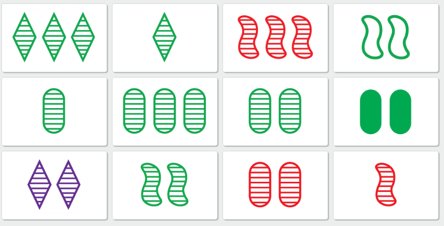
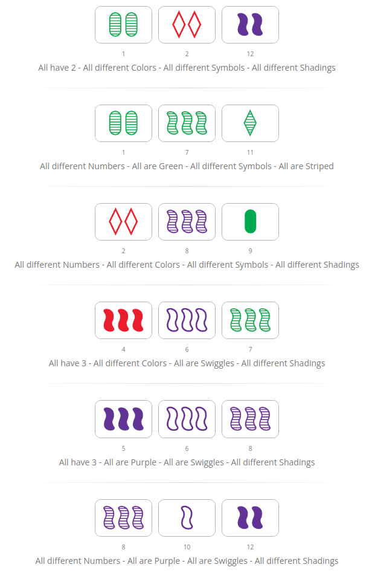

# CS-162 Portfolio Project Proposal: Set Card Game Project


For this project, students will write a class called `SetGame` that allows two people to play a console-based version of the card game Set.

## Description
* Set is a card game that is typically played with with 2-6 people, although you can also play on your own.
* Cards have unique idenfiers, i.e.:
  * A unique **number**: 1, 2, 3
  * A unique **symbol**: diamond, squiggle, oval
  * A unique **shading**: open, striped, solid
  * A unique **color**: green, blue, red
* There are 81 **isomorphic** cards, all of which are unique (3 * 3 * 3 * 3 = 81). Check out the image below! 
* The main goal of the game is to find combinations of three cards that produce a 'Set'. 


Sauce: [Wikipedia](https://en.wikipedia.org/wiki/Set_(card_game))

## So, What Constitutes a Set?
* A set satisfies all of the the conditions:
  * Same number or 3 different numbers. 
  * Same shape or 3 different shapes.
  * Same shading or 3 different shadings.
  * Same color or 3 different colors. 
* For example, the following three cards from a Set deck would constitute a set. Note each of the cards have a unique number, symbol, shading, and color, and are thus a set. 
 
 
 Sauce: [Wikipedia](https://en.wikipedia.org/wiki/Set_(card_game))
* Here are a few more explicit examples.

* You can try this [Set demo](http://www.setgame.com/set/puzzle) to get an idea of what is, and isn't a Set! This was used to generate the examples shown above.

## Game Play and Rules
* The game is normally played by dealing 12, 15, 18 or more cards on the table. 
* A player calls "Set!" when he/she think they have spotted 3 cards that comprise a Set.
* If it's a valid set, the three cards are removed from the table and into the players pile. The board is then replenished with cards from the deck. 
* Play continues until all cards have been played to the table and no more sets are to be found.
  * Note: A set may not always be present, in which case the dealer can exchange cards with the reserve deck. 
* At the end of the game, players count how many cards they have in their stack at the end (each card is worth one point). The winner with the most points wins!

## Additional Resources
* More background on the wikipedia page [here](https://en.wikipedia.org/wiki/Set_(card_game)).
* Alternative Set Instructions [here](https://www.setgame.com/sites/default/files/instructions/SET%20INSTRUCTIONS%20-%20ENGLISH.pdf).

## Implementation
Your code for the game must define the following class and methods described below. All data members must be **private**. Feel free to use a composition-, inheritance-, or mixed-OOP approach where it makes sense!

### SetGame Class 
The `SetGame` object represents the game as played. The class should contain information about the players and table. It should contain the following methods (but may have more):
* **create_player**: should create and add up to 6 players to the game.
* **create_deck**: should create/initialize a deck of 81 isomorphic cards. 
* **call_set**(player_id, [card_1_id, card_2_id, card_3_id]): allows a player to call a Set. The first argument is the player id, and the second argument is a list representing the individual unique card identifiers.
  * The method should first validate the user input.
    * The identifiers for the card should be valid, and the cards should be currently in play on the table (they can't point to cards in the Deck). 
    * It should return "Invalid player id" if the player id is not valid.
    * It should return "Invalid number of cards" if the number of items in the list is not equal to 3.
  * The method should also verify/check the validity of the Set itself.
    * The method should return the string "That's a spiccyy Set" if it's a valid Set.
    * The method should return the string "Not quite a Set...better luck next time!" if it's an invalid Set.
  * If the set is valid, the score of the user should be updated, and the cards should be cleared from the board. The removed cards should automatically be replaced with cards from the reserve deck.  
* **declare_winner**: declares the winner of the game. 
  * If the game is not yet ended, returns "Game has not ended. There are still more Sets to find!"
  * If it is a tie, it should return "It's a tie! Everyone loses!"
  * Otherwise, it should return "Player <id> is the winner!", where <id> is the player id.

### Deck Class
A `Deck` object represents the reserve cards (not in play on the Table). Cards may be moved to/from the deck to the table, or to player piles.
* **shuffle_deck**: should shuffle the reserve card deck.

### Table Class
A `Table` object represents a board from which to display cards in play.
* **swap_cards**(n): swaps n cards at random between the reserve deck and the table. 
  * If there are less than n cards left in the deck, say k cards remaining, then only k cards should be swapped. 
* **display_table**(): should print the table.
  * A card can be represented as <1,2,3>\_<diamond,squiggle,oval>\_<open,striped,fill>\_<green,blue,red>
  * For example, the first Set shown above would be represented by the following strings:
    * `'1_diamond_open_green'`
    * `'2_squiggle_striped_blue'`
    * `'3_oval_fill_red'`
  * The method should output the current cards in play on the table (order does not matter):
  ```python
  Board (cards in play):
  ['1_diamond_open_green', '2_squiggle_striped_blue', '3_oval_fill_red',...]
  ```

### Players Class
The `Player` object represents individual players. It may have attributes for the id, score, etc.

### Card Class
The `Card` objects represent individual cards. The card class should have attributes to describe the number, symbol, shape, and color. 

## Extra Credit
* Implement a method `save_game` for state preservation, and a method `load_game` to load a previously saved state.
* Implement logic to incur penalties for incorrect Sets given by players, i.e. players should be able to accumulate negative points if they make an incorrect guess, and that should factor into the final declaration for the winner.


